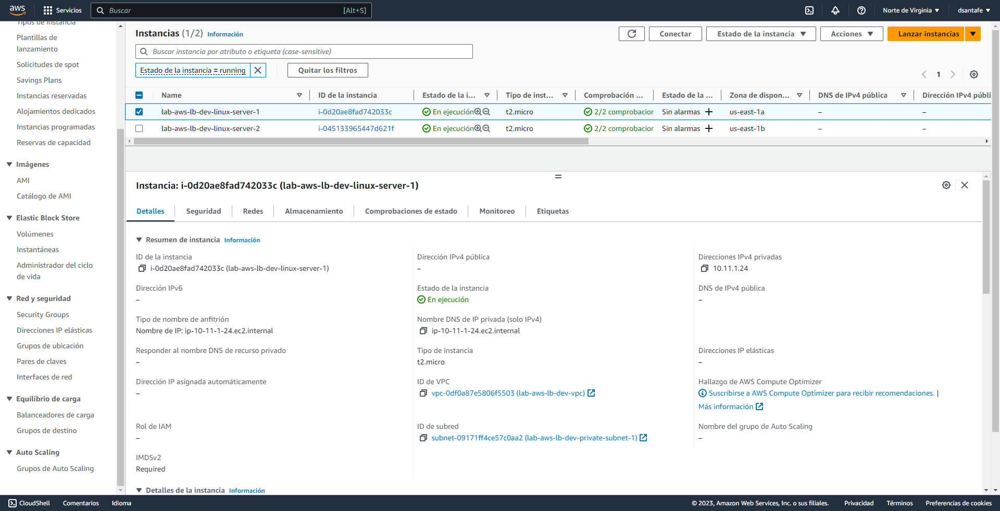
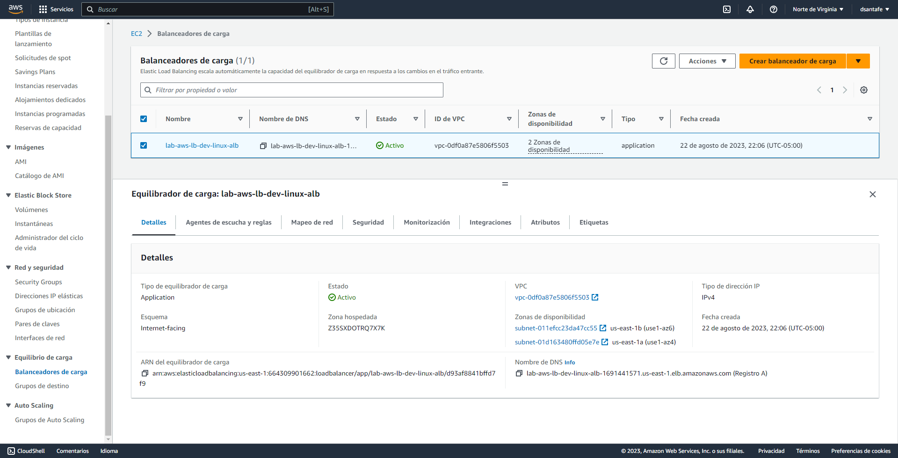
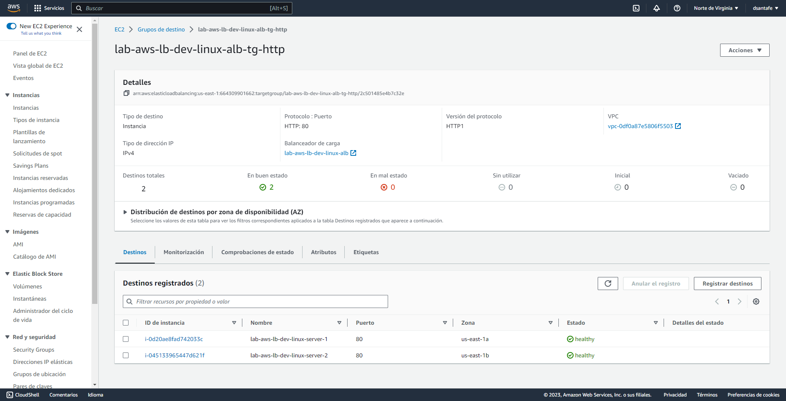

# Configuración de Ejemplo: AWS, Terraform y Balanceador de Carga
Este repositorio contiene una configuración de ejemplo para crear una infraestructura básica en AWS utilizando Terraform. En esta configuración, se crea un balanceador de carga de aplicaciones (ALB) que distribuye el tráfico entre dos instancias Linux que ejecutan servidores web Apache. Cada instancia muestra su nombre de host cuando se accede a través del balanceador de carga.

## Requisitos Previos
Antes de comenzar, asegúrate de tener lo siguiente:

1. Una cuenta de AWS y [las credenciales de AWS configuradas](https://docs.aws.amazon.com/es_es/cli/latest/userguide/cli-configure-quickstart.html).
2. [Terraform](https://www.terraform.io/downloads.html) instalado en tu máquina local.
3. Dado que el archivo principal de terraform se va a cargar en el repositorio de código con todo el proyecto, claramente no podemos almacenar ningún dato sensible. Así que pongamos la clave secreta y la clave de acceso en un archivo diferente, y coloquemos este archivo en nuestro gitignore.

Para separar los datos sensibles, crea un archivo en el mismo directorio llamado terraform.tfvars. Y decláralos así:

```terraform
# Application Definition 
app_name        = "lab-aws-lb" # Do NOT enter any spaces
app_environment = "dev"        # Dev, Test, Staging, Prod, etc

# Network
vpc_cidr              = "10.11.0.0/16"
private_subnet_cidr_1 = "10.11.1.0/24"
private_subnet_cidr_2 = "10.11.2.0/24"
public_subnet_cidr    = "10.11.4.0/24"

# AWS Settings
aws_access_key = "complete-this"
aws_secret_key = "complete-this"
aws_region     = "us-east-1"

# Linux Virtual Machine
ec2_count              = 2
linux_instance_type    = "t2.micro"
linux_root_volume_size = 20
linux_root_volume_type = "gp2"
linux_data_volume_size = 10
linux_data_volume_type = "gp2"

```

## Pasos de ejecución
1. Clona este repositorio en tu máquina local:
```bash
git clone https://github.com/dsantafe/Bootcamp-Devops-Engineer.git
cd Bootcamp-Devops-Engineer/labs/lab-03-terraform-aws-load-balancer
```

2. Abre el archivo linux-vm-variables.tf y realiza las siguientes modificaciones:

Cambia el valor de region para seleccionar la región de AWS donde deseas crear la máquina virtual.
Si es necesario, cambia el valor de ami para seleccionar la AMI de Linux que prefieras.
Verifica la configuración de key_name para asegurarte de que corresponde al nombre de tu llave SSH en AWS.

3. Ejecuta el siguiente comando para inicializar el directorio de trabajo de Terraform:
```bash
terraform init
```

4. Antes de crear los recursos, verifica qué recursos se crearán con el siguiente comando:
```bash
terraform plan
```

5. Si la salida del comando terraform plan es correcta, procede a crear la máquina virtual con el siguiente comando:
```bash
terraform apply
```

Será necesario confirmar la creación de los recursos escribiendo "yes" cuando se te solicite.

6. Una vez que la infraestructura esté creada, la salida de Terraform mostrará la dirección DNS del balanceador de carga. Abre un navegador web y accede a la dirección DNS del balanceador de carga. Verás una página que muestra alternativamente el nombre de host de cada instancia.

7. Para conectarte a las instancias via SSH, asegúrate de tener la clave privada generada (lab-aws-lb-dev-windows-us-east-1) en tu máquina local. Actualiza tu archivo ~/.ssh/config con las entradas de host para cada instancia, usando el nombre de host como se muestra en la página del balanceador de carga.

8. Con las configuraciones adecuadas en tu archivo SSH config, puedes conectarte a las instancias utilizando comandos como:
```bash
ssh lab-aws-lb-dev-linux-server-1
```

## Output del terraform plan.
```bash
Note: You didn't use the -out option to save this plan, so Terraform can't guarantee to take exactly these actions if you run "terraform apply" now.        
PS D:\workspace-git\Bootcamp-Devops-Engineer\labs\lab-03-terraform-aws-load-balancer> terraform apply  

Terraform used the selected providers to generate the following execution plan. Resource actions are indicated with the following symbols:
  + create

Terraform will perform the following actions:

  # aws_alb_target_group_attachment.linux-alb-target-group-http-attach[0] will be created
  + resource "aws_alb_target_group_attachment" "linux-alb-target-group-http-attach" {
      + id               = (known after apply)
      + port             = 80
      + target_group_arn = (known after apply)
      + target_id        = (known after apply)
    }

  # aws_alb_target_group_attachment.linux-alb-target-group-http-attach[1] will be created
  + resource "aws_alb_target_group_attachment" "linux-alb-target-group-http-attach" {
      + id               = (known after apply)
      + port             = 80
      + target_group_arn = (known after apply)
      + target_id        = (known after apply)
    }

  # aws_eip.nat-eip will be created
  + resource "aws_eip" "nat-eip" {
      + allocation_id        = (known after apply)
      + association_id       = (known after apply)
      + carrier_ip           = (known after apply)
      + customer_owned_ip    = (known after apply)
      + domain               = (known after apply)
      + id                   = (known after apply)
      + instance             = (known after apply)
      + network_border_group = (known after apply)
      + network_interface    = (known after apply)
      + private_dns          = (known after apply)
      + private_ip           = (known after apply)
      + public_dns           = (known after apply)
      + public_ip            = (known after apply)
      + public_ipv4_pool     = (known after apply)
      + tags                 = {
          + "Environment" = "dev"
          + "Name"        = "lab-aws-lb-dev-nat-eip"
        }
      + tags_all             = {
          + "Environment" = "dev"
          + "Name"        = "lab-aws-lb-dev-nat-eip"
        }
      + vpc                  = true
    }

  # aws_instance.linux-server[0] will be created
  + resource "aws_instance" "linux-server" {
      + ami                                  = "ami-08a52ddb321b32a8c"
      + arn                                  = (known after apply)
      + associate_public_ip_address          = false
      + availability_zone                    = (known after apply)
      + cpu_core_count                       = (known after apply)
      + cpu_threads_per_core                 = (known after apply)
      + disable_api_stop                     = (known after apply)
      + disable_api_termination              = (known after apply)
      + ebs_optimized                        = (known after apply)
      + get_password_data                    = false
      + host_id                              = (known after apply)
      + host_resource_group_arn              = (known after apply)
      + iam_instance_profile                 = (known after apply)
      + id                                   = (known after apply)
      + instance_initiated_shutdown_behavior = (known after apply)
      + instance_lifecycle                   = (known after apply)
      + instance_state                       = (known after apply)
      + instance_type                        = "t2.micro"
      + ipv6_address_count                   = (known after apply)
      + ipv6_addresses                       = (known after apply)
      + key_name                             = "lab-aws-lb-dev-windows-us-east-1"
      + monitoring                           = (known after apply)
      + outpost_arn                          = (known after apply)
      + password_data                        = (known after apply)
      + placement_group                      = (known after apply)
      + placement_partition_number           = (known after apply)
      + primary_network_interface_id         = (known after apply)
      + private_dns                          = (known after apply)
      + private_ip                           = (known after apply)
      + public_dns                           = (known after apply)
      + public_ip                            = (known after apply)
      + secondary_private_ips                = (known after apply)
      + security_groups                      = (known after apply)
      + source_dest_check                    = false
      + spot_instance_request_id             = (known after apply)
      + subnet_id                            = (known after apply)
      + tags                                 = {
          + "Environment" = "dev"
          + "Name"        = "lab-aws-lb-dev-linux-server-1"
        }
      + tags_all                             = {
          + "Environment" = "dev"
          + "Name"        = "lab-aws-lb-dev-linux-server-1"
        }
      + tenancy                              = (known after apply)
      + user_data                            = "896c17d7124ee2f001894a26565ac0719f580a89"
      + user_data_base64                     = (known after apply)
      + user_data_replace_on_change          = false
      + vpc_security_group_ids               = (known after apply)

      + ebs_block_device {
          + delete_on_termination = true
          + device_name           = "/dev/xvda"
          + encrypted             = true
          + iops                  = (known after apply)
          + kms_key_id            = (known after apply)
          + snapshot_id           = (known after apply)
          + throughput            = (known after apply)
          + volume_id             = (known after apply)
          + volume_size           = 10
          + volume_type           = "gp2"
        }

      + root_block_device {
          + delete_on_termination = true
          + device_name           = (known after apply)
          + encrypted             = true
          + iops                  = (known after apply)
          + kms_key_id            = (known after apply)
          + throughput            = (known after apply)
          + volume_id             = (known after apply)
          + volume_size           = 20
          + volume_type           = "gp2"
        }
    }

  # aws_instance.linux-server[1] will be created
  + resource "aws_instance" "linux-server" {
      + ami                                  = "ami-08a52ddb321b32a8c"
      + arn                                  = (known after apply)
      + associate_public_ip_address          = false
      + availability_zone                    = (known after apply)
      + cpu_core_count                       = (known after apply)
      + cpu_threads_per_core                 = (known after apply)
      + disable_api_stop                     = (known after apply)
      + disable_api_termination              = (known after apply)
      + ebs_optimized                        = (known after apply)
      + get_password_data                    = false
      + host_id                              = (known after apply)
      + host_resource_group_arn              = (known after apply)
      + iam_instance_profile                 = (known after apply)
      + id                                   = (known after apply)
      + instance_initiated_shutdown_behavior = (known after apply)
      + instance_lifecycle                   = (known after apply)
      + instance_state                       = (known after apply)
      + instance_type                        = "t2.micro"
      + ipv6_address_count                   = (known after apply)
      + ipv6_addresses                       = (known after apply)
      + key_name                             = "lab-aws-lb-dev-windows-us-east-1"
      + monitoring                           = (known after apply)
      + outpost_arn                          = (known after apply)
      + password_data                        = (known after apply)
      + placement_group                      = (known after apply)
      + placement_partition_number           = (known after apply)
      + primary_network_interface_id         = (known after apply)
      + private_dns                          = (known after apply)
      + private_ip                           = (known after apply)
      + public_dns                           = (known after apply)
      + public_ip                            = (known after apply)
      + secondary_private_ips                = (known after apply)
      + security_groups                      = (known after apply)
      + source_dest_check                    = false
      + spot_instance_request_id             = (known after apply)
      + subnet_id                            = (known after apply)
      + tags                                 = {
          + "Environment" = "dev"
          + "Name"        = "lab-aws-lb-dev-linux-server-2"
        }
      + tags_all                             = {
          + "Environment" = "dev"
          + "Name"        = "lab-aws-lb-dev-linux-server-2"
        }
      + tenancy                              = (known after apply)
      + user_data                            = "896c17d7124ee2f001894a26565ac0719f580a89"
      + user_data_base64                     = (known after apply)
      + user_data_replace_on_change          = false
      + vpc_security_group_ids               = (known after apply)

      + ebs_block_device {
          + delete_on_termination = true
          + device_name           = "/dev/xvda"
          + encrypted             = true
          + iops                  = (known after apply)
          + kms_key_id            = (known after apply)
          + snapshot_id           = (known after apply)
          + throughput            = (known after apply)
          + volume_id             = (known after apply)
          + volume_size           = 10
          + volume_type           = "gp2"
        }

      + root_block_device {
          + delete_on_termination = true
          + device_name           = (known after apply)
          + encrypted             = true
          + iops                  = (known after apply)
          + kms_key_id            = (known after apply)
          + throughput            = (known after apply)
          + volume_id             = (known after apply)
          + volume_size           = 20
          + volume_type           = "gp2"
        }
    }

  # aws_internet_gateway.gw will be created
  + resource "aws_internet_gateway" "gw" {
      + arn      = (known after apply)
      + id       = (known after apply)
      + owner_id = (known after apply)
      + tags     = {
          + "Environment" = "dev"
          + "Name"        = "lab-aws-lb-dev-igw"
        }
      + tags_all = {
          + "Environment" = "dev"
          + "Name"        = "lab-aws-lb-dev-igw"
        }
      + vpc_id   = (known after apply)
    }

  # aws_key_pair.key_pair will be created
  + resource "aws_key_pair" "key_pair" {
      + arn             = (known after apply)
      + fingerprint     = (known after apply)
      + id              = (known after apply)
      + key_name        = "lab-aws-lb-dev-windows-us-east-1"
      + key_name_prefix = (known after apply)
      + key_pair_id     = (known after apply)
      + key_type        = (known after apply)
      + public_key      = (known after apply)
      + tags_all        = (known after apply)
    }

  # aws_lb.linux-alb will be created
  + resource "aws_lb" "linux-alb" {
      + arn                                         = (known after apply)
      + arn_suffix                                  = (known after apply)
      + desync_mitigation_mode                      = "defensive"
      + dns_name                                    = (known after apply)
      + drop_invalid_header_fields                  = false
      + enable_deletion_protection                  = false
      + enable_http2                                = false
      + enable_tls_version_and_cipher_suite_headers = false
      + enable_waf_fail_open                        = false
      + enable_xff_client_port                      = false
      + id                                          = (known after apply)
      + idle_timeout                                = 60
      + internal                                    = false
      + ip_address_type                             = (known after apply)
      + load_balancer_type                          = "application"
      + name                                        = "lab-aws-lb-dev-linux-alb"
      + preserve_host_header                        = false
      + security_groups                             = (known after apply)
      + subnets                                     = (known after apply)
      + tags                                        = {
          + "Environment" = "dev"
          + "Name"        = "lab-aws-lb-dev-linux-alb"
        }
      + tags_all                                    = {
          + "Environment" = "dev"
          + "Name"        = "lab-aws-lb-dev-linux-alb"
        }
      + vpc_id                                      = (known after apply)
      + xff_header_processing_mode                  = "append"
      + zone_id                                     = (known after apply)
    }

  # aws_lb_listener.linux-alb-listener-http will be created
  + resource "aws_lb_listener" "linux-alb-listener-http" {
      + arn               = (known after apply)
      + id                = (known after apply)
      + load_balancer_arn = (known after apply)
      + port              = 80
      + protocol          = "HTTP"
      + ssl_policy        = (known after apply)
      + tags_all          = (known after apply)

      + default_action {
          + order            = (known after apply)
          + target_group_arn = (known after apply)
          + type             = "forward"
        }
    }

  # aws_lb_target_group.linux-alb-target-group-http will be created
  + resource "aws_lb_target_group" "linux-alb-target-group-http" {
      + arn                                = (known after apply)
      + arn_suffix                         = (known after apply)
      + connection_termination             = false
      + deregistration_delay               = "300"
      + id                                 = (known after apply)
      + ip_address_type                    = (known after apply)
      + lambda_multi_value_headers_enabled = false
      + load_balancing_algorithm_type      = "round_robin"
      + load_balancing_cross_zone_enabled  = (known after apply)
      + name                               = "lab-aws-lb-dev-linux-alb-tg-http"
      + port                               = 80
      + preserve_client_ip                 = (known after apply)
      + protocol                           = "HTTP"
      + protocol_version                   = (known after apply)
      + proxy_protocol_v2                  = false
      + slow_start                         = 0
      + tags_all                           = (known after apply)
      + target_type                        = "instance"
      + vpc_id                             = (known after apply)

      + health_check {
          + enabled             = true
          + healthy_threshold   = 3
          + interval            = 30
          + matcher             = "200,301,302"
          + path                = "/"
          + port                = "80"
          + protocol            = "HTTP"
          + timeout             = 10
          + unhealthy_threshold = 3
        }

      + stickiness {
          + cookie_duration = 86400
          + enabled         = false
          + type            = "lb_cookie"
        }
    }

  # aws_nat_gateway.nat will be created
  + resource "aws_nat_gateway" "nat" {
      + allocation_id                      = (known after apply)
      + association_id                     = (known after apply)
      + connectivity_type                  = "public"
      + id                                 = (known after apply)
      + network_interface_id               = (known after apply)
      + private_ip                         = (known after apply)
      + public_ip                          = (known after apply)
      + secondary_private_ip_address_count = (known after apply)
      + secondary_private_ip_addresses     = (known after apply)
      + subnet_id                          = (known after apply)
      + tags                               = {
          + "Environment" = "dev"
          + "Name"        = "lab-aws-lb-dev-nat-gateway"
        }
      + tags_all                           = {
          + "Environment" = "dev"
          + "Name"        = "lab-aws-lb-dev-nat-gateway"
        }
    }

  # aws_route_table.private-rt will be created
  + resource "aws_route_table" "private-rt" {
      + arn              = (known after apply)
      + id               = (known after apply)
      + owner_id         = (known after apply)
      + propagating_vgws = (known after apply)
      + route            = [
          + {
              + carrier_gateway_id         = ""
              + cidr_block                 = "0.0.0.0/0"
              + core_network_arn           = ""
              + destination_prefix_list_id = ""
              + egress_only_gateway_id     = ""
              + gateway_id                 = (known after apply)
              + ipv6_cidr_block            = ""
              + local_gateway_id           = ""
              + nat_gateway_id             = ""
              + network_interface_id       = ""
              + transit_gateway_id         = ""
              + vpc_endpoint_id            = ""
              + vpc_peering_connection_id  = ""
            },
        ]
      + tags             = {
          + "Environment" = "dev"
          + "Name"        = "lab-aws-lb-dev-private-subnet-rt"
        }
      + tags_all         = {
          + "Environment" = "dev"
          + "Name"        = "lab-aws-lb-dev-private-subnet-rt"
        }
      + vpc_id           = (known after apply)
    }

  # aws_route_table.public-rt will be created
  + resource "aws_route_table" "public-rt" {
      + arn              = (known after apply)
      + id               = (known after apply)
      + owner_id         = (known after apply)
      + propagating_vgws = (known after apply)
      + route            = [
          + {
              + carrier_gateway_id         = ""
              + cidr_block                 = "0.0.0.0/0"
              + core_network_arn           = ""
              + destination_prefix_list_id = ""
              + egress_only_gateway_id     = ""
              + gateway_id                 = (known after apply)
              + ipv6_cidr_block            = ""
              + local_gateway_id           = ""
              + nat_gateway_id             = ""
              + network_interface_id       = ""
              + transit_gateway_id         = ""
              + vpc_endpoint_id            = ""
              + vpc_peering_connection_id  = ""
            },
        ]
      + tags             = {
          + "Environment" = "dev"
          + "Name"        = "lab-aws-lb-dev-public-subnet-rt"
        }
      + tags_all         = {
          + "Environment" = "dev"
          + "Name"        = "lab-aws-lb-dev-public-subnet-rt"
        }
      + vpc_id           = (known after apply)
    }

  # aws_route_table_association.private-rt-1-association will be created
  + resource "aws_route_table_association" "private-rt-1-association" {
      + id             = (known after apply)
      + route_table_id = (known after apply)
      + subnet_id      = (known after apply)
    }

  # aws_route_table_association.private-rt-2-association will be created
  + resource "aws_route_table_association" "private-rt-2-association" {
      + id             = (known after apply)
      + route_table_id = (known after apply)
      + subnet_id      = (known after apply)
    }

  # aws_route_table_association.public-rt-1-association will be created
  + resource "aws_route_table_association" "public-rt-1-association" {
      + id             = (known after apply)
      + route_table_id = (known after apply)
      + subnet_id      = (known after apply)
    }

  # aws_route_table_association.public-rt-2-association will be created
  + resource "aws_route_table_association" "public-rt-2-association" {
      + id             = (known after apply)
      + route_table_id = (known after apply)
      + subnet_id      = (known after apply)
    }

  # aws_security_group.aws-linux-sg will be created
  + resource "aws_security_group" "aws-linux-sg" {
      + arn                    = (known after apply)
      + description            = "Allow incoming HTTP connections"
      + egress                 = [
          + {
              + cidr_blocks      = [
                  + "0.0.0.0/0",
                ]
              + description      = ""
              + from_port        = 0
              + ipv6_cidr_blocks = []
              + prefix_list_ids  = []
              + protocol         = "-1"
              + security_groups  = []
              + self             = false
              + to_port          = 0
            },
        ]
      + id                     = (known after apply)
      + ingress                = [
          + {
              + cidr_blocks      = [
                  + "0.0.0.0/0",
                ]
              + description      = "Allow incoming HTTP connections"
              + from_port        = 80
              + ipv6_cidr_blocks = []
              + prefix_list_ids  = []
              + protocol         = "tcp"
              + security_groups  = []
              + self             = false
              + to_port          = 80
            },
          + {
              + cidr_blocks      = [
                  + "0.0.0.0/0",
                ]
              + description      = "Allow incoming HTTPS connections"
              + from_port        = 443
              + ipv6_cidr_blocks = []
              + prefix_list_ids  = []
              + protocol         = "tcp"
              + security_groups  = []
              + self             = false
              + to_port          = 443
            },
          + {
              + cidr_blocks      = [
                  + "0.0.0.0/0",
                ]
              + description      = "Allow incoming SSH connections"
              + from_port        = 22
              + ipv6_cidr_blocks = []
              + prefix_list_ids  = []
              + protocol         = "tcp"
              + security_groups  = []
              + self             = false
              + to_port          = 22
            },
        ]
      + name                   = "lab-aws-lb-dev-linux-sg"
      + name_prefix            = (known after apply)
      + owner_id               = (known after apply)
      + revoke_rules_on_delete = false
      + tags                   = {
          + "Environment" = "dev"
          + "Name"        = "lab-aws-lb-dev-linux-sg"
        }
      + tags_all               = {
          + "Environment" = "dev"
          + "Name"        = "lab-aws-lb-dev-linux-sg"
        }
      + vpc_id                 = (known after apply)
    }

  # aws_security_group.linux-alb-sg will be created
  + resource "aws_security_group" "linux-alb-sg" {
      + arn                    = (known after apply)
      + description            = "Allow web traffic to the load balancer"
      + egress                 = [
          + {
              + cidr_blocks      = [
                  + "0.0.0.0/0",
                ]
              + description      = ""
              + from_port        = 0
              + ipv6_cidr_blocks = []
              + prefix_list_ids  = []
              + protocol         = "-1"
              + security_groups  = []
              + self             = false
              + to_port          = 0
            },
        ]
      + id                     = (known after apply)
      + ingress                = [
          + {
              + cidr_blocks      = [
                  + "0.0.0.0/0",
                ]
              + description      = ""
              + from_port        = 443
              + ipv6_cidr_blocks = []
              + prefix_list_ids  = []
              + protocol         = "tcp"
              + security_groups  = []
              + self             = false
              + to_port          = 443
            },
          + {
              + cidr_blocks      = [
                  + "0.0.0.0/0",
                ]
              + description      = ""
              + from_port        = 80
              + ipv6_cidr_blocks = []
              + prefix_list_ids  = []
              + protocol         = "tcp"
              + security_groups  = []
              + self             = false
              + to_port          = 80
            },
        ]
      + name                   = "lab-aws-lb-dev-linux-alb-sg"
      + name_prefix            = (known after apply)
      + owner_id               = (known after apply)
      + revoke_rules_on_delete = false
      + tags                   = {
          + "Environment" = "dev"
          + "Name"        = "lab-aws-lb-dev-linux-alb-sg"
        }
      + tags_all               = {
          + "Environment" = "dev"
          + "Name"        = "lab-aws-lb-dev-linux-alb-sg"
        }
      + vpc_id                 = (known after apply)
    }

  # aws_subnet.private-subnet-1 will be created
  + resource "aws_subnet" "private-subnet-1" {
      + arn                                            = (known after apply)
      + assign_ipv6_address_on_creation                = false
      + availability_zone                              = "us-east-1a"
      + availability_zone_id                           = (known after apply)
      + cidr_block                                     = "10.11.1.0/24"
      + enable_dns64                                   = false
      + enable_resource_name_dns_a_record_on_launch    = false
      + enable_resource_name_dns_aaaa_record_on_launch = false
      + id                                             = (known after apply)
      + ipv6_cidr_block_association_id                 = (known after apply)
      + ipv6_native                                    = false
      + map_public_ip_on_launch                        = false
      + owner_id                                       = (known after apply)
      + private_dns_hostname_type_on_launch            = (known after apply)
      + tags                                           = {
          + "Environment" = "dev"
          + "Name"        = "lab-aws-lb-dev-private-subnet-1"
        }
      + tags_all                                       = {
          + "Environment" = "dev"
          + "Name"        = "lab-aws-lb-dev-private-subnet-1"
        }
      + vpc_id                                         = (known after apply)
    }

  # aws_subnet.private-subnet-2 will be created
  + resource "aws_subnet" "private-subnet-2" {
      + arn                                            = (known after apply)
      + assign_ipv6_address_on_creation                = false
      + availability_zone                              = "us-east-1b"
      + availability_zone_id                           = (known after apply)
      + cidr_block                                     = "10.11.2.0/24"
      + enable_dns64                                   = false
      + enable_resource_name_dns_a_record_on_launch    = false
      + enable_resource_name_dns_aaaa_record_on_launch = false
      + id                                             = (known after apply)
      + ipv6_cidr_block_association_id                 = (known after apply)
      + ipv6_native                                    = false
      + map_public_ip_on_launch                        = false
      + owner_id                                       = (known after apply)
      + private_dns_hostname_type_on_launch            = (known after apply)
      + tags                                           = {
          + "Environment" = "dev"
          + "Name"        = "lab-aws-lb-dev-private-subnet-2"
        }
      + tags_all                                       = {
          + "Environment" = "dev"
          + "Name"        = "lab-aws-lb-dev-private-subnet-2"
        }
      + vpc_id                                         = (known after apply)
    }

  # aws_subnet.public-subnet-1 will be created
  + resource "aws_subnet" "public-subnet-1" {
      + arn                                            = (known after apply)
      + assign_ipv6_address_on_creation                = false
      + availability_zone                              = "us-east-1a"
      + availability_zone_id                           = (known after apply)
      + cidr_block                                     = "10.11.3.0/24"
      + enable_dns64                                   = false
      + enable_resource_name_dns_a_record_on_launch    = false
      + enable_resource_name_dns_aaaa_record_on_launch = false
      + id                                             = (known after apply)
      + ipv6_cidr_block_association_id                 = (known after apply)
      + ipv6_native                                    = false
      + map_public_ip_on_launch                        = false
      + owner_id                                       = (known after apply)
      + private_dns_hostname_type_on_launch            = (known after apply)
      + tags                                           = {
          + "Environment" = "dev"
          + "Name"        = "lab-aws-lb-dev-public-subnet-1"
        }
      + tags_all                                       = {
          + "Environment" = "dev"
          + "Name"        = "lab-aws-lb-dev-public-subnet-1"
        }
      + vpc_id                                         = (known after apply)
    }

  # aws_subnet.public-subnet-2 will be created
  + resource "aws_subnet" "public-subnet-2" {
      + arn                                            = (known after apply)
      + assign_ipv6_address_on_creation                = false
      + availability_zone                              = "us-east-1b"
      + availability_zone_id                           = (known after apply)
      + cidr_block                                     = "10.11.4.0/24"
      + enable_dns64                                   = false
      + enable_resource_name_dns_a_record_on_launch    = false
      + enable_resource_name_dns_aaaa_record_on_launch = false
      + id                                             = (known after apply)
      + ipv6_cidr_block_association_id                 = (known after apply)
      + ipv6_native                                    = false
      + map_public_ip_on_launch                        = false
      + owner_id                                       = (known after apply)
      + private_dns_hostname_type_on_launch            = (known after apply)
      + tags                                           = {
          + "Environment" = "dev"
          + "Name"        = "lab-aws-lb-dev-public-subnet-2"
        }
      + tags_all                                       = {
          + "Environment" = "dev"
          + "Name"        = "lab-aws-lb-dev-public-subnet-2"
        }
      + vpc_id                                         = (known after apply)
    }

  # aws_vpc.vpc will be created
  + resource "aws_vpc" "vpc" {
      + arn                                  = (known after apply)
      + cidr_block                           = "10.11.0.0/16"
      + default_network_acl_id               = (known after apply)
      + default_route_table_id               = (known after apply)
      + default_security_group_id            = (known after apply)
      + dhcp_options_id                      = (known after apply)
      + enable_dns_hostnames                 = true
      + enable_dns_support                   = true
      + enable_network_address_usage_metrics = (known after apply)
      + id                                   = (known after apply)
      + instance_tenancy                     = "default"
      + ipv6_association_id                  = (known after apply)
      + ipv6_cidr_block                      = (known after apply)
      + ipv6_cidr_block_network_border_group = (known after apply)
      + main_route_table_id                  = (known after apply)
      + owner_id                             = (known after apply)
      + tags                                 = {
          + "Environment" = "dev"
          + "Name"        = "lab-aws-lb-dev-vpc"
        }
      + tags_all                             = {
          + "Environment" = "dev"
          + "Name"        = "lab-aws-lb-dev-vpc"
        }
    }

  # local_file.ssh_key will be created
  + resource "local_file" "ssh_key" {
      + content              = (sensitive value)
      + content_base64sha256 = (known after apply)
      + content_base64sha512 = (known after apply)
      + content_md5          = (known after apply)
      + content_sha1         = (known after apply)
      + content_sha256       = (known after apply)
      + content_sha512       = (known after apply)
      + directory_permission = "0777"
      + file_permission      = "0777"
      + filename             = "lab-aws-lb-dev-windows-us-east-1.pem"
      + id                   = (known after apply)
    }

  # tls_private_key.key_pair will be created
  + resource "tls_private_key" "key_pair" {
      + algorithm                     = "RSA"
      + ecdsa_curve                   = "P224"
      + id                            = (known after apply)
      + private_key_openssh           = (sensitive value)
      + private_key_pem               = (sensitive value)
      + private_key_pem_pkcs8         = (sensitive value)
      + public_key_fingerprint_md5    = (known after apply)
      + public_key_fingerprint_sha256 = (known after apply)
      + public_key_openssh            = (known after apply)
      + public_key_pem                = (known after apply)
      + rsa_bits                      = 4096
    }

Plan: 26 to add, 0 to change, 0 to destroy.

Changes to Outputs:
  + lb_dns_name                         = (known after apply)
  + vm_linux_server_instance_id         = [
      + (known after apply),
      + (known after apply),
    ]
  + vm_linux_server_instance_private_ip = [
      + (known after apply),
      + (known after apply),
    ]

Do you want to perform these actions?
  Terraform will perform the actions described above.
  Only 'yes' will be accepted to approve.

  Enter a value: yes

tls_private_key.key_pair: Creating...
aws_vpc.vpc: Creating...
aws_eip.nat-eip: Creating...
aws_eip.nat-eip: Creation complete after 1s [id=eipalloc-0d83413e41e752c49]
tls_private_key.key_pair: Still creating... [10s elapsed]
tls_private_key.key_pair: Creation complete after 10s [id=13ae17d3b8a7510879c418c299070064b31a7d39]
aws_key_pair.key_pair: Creating...
aws_key_pair.key_pair: Creation complete after 0s [id=lab-aws-lb-dev-windows-us-east-1]
local_file.ssh_key: Creating...
local_file.ssh_key: Creation complete after 0s [id=a1a034f78d31c4ecf4a42a5065182c934c1ace70]
aws_vpc.vpc: Still creating... [10s elapsed]
aws_vpc.vpc: Creation complete after 13s [id=vpc-0df0a87e5806f5503]
aws_internet_gateway.gw: Creating...
aws_subnet.public-subnet-1: Creating...
aws_subnet.private-subnet-2: Creating...
aws_subnet.public-subnet-2: Creating...
aws_subnet.private-subnet-1: Creating...
aws_lb_target_group.linux-alb-target-group-http: Creating...
aws_security_group.linux-alb-sg: Creating...
aws_security_group.aws-linux-sg: Creating...
aws_internet_gateway.gw: Creation complete after 1s [id=igw-0bd5adc45193092ef]
aws_subnet.private-subnet-1: Creation complete after 1s [id=subnet-09171ff4ce57c0aa2]
aws_subnet.public-subnet-2: Creation complete after 1s [id=subnet-011efcc23da47cc55]
aws_subnet.public-subnet-1: Creation complete after 1s [id=subnet-01d163480ffd05e7e]
aws_route_table.public-rt: Creating...
aws_subnet.private-subnet-2: Creation complete after 1s [id=subnet-065dca963f1c78aed]
aws_nat_gateway.nat: Creating...
aws_lb_target_group.linux-alb-target-group-http: Creation complete after 2s [id=arn:aws:elasticloadbalancing:us-east-1:664309901662:targetgroup/lab-aws-lb-dev-linux-alb-tg-http/2c501485e4b7c32e]
aws_route_table.public-rt: Creation complete after 1s [id=rtb-03513c77576d292eb]
aws_route_table_association.public-rt-2-association: Creating...
aws_route_table_association.public-rt-1-association: Creating...
aws_security_group.linux-alb-sg: Creation complete after 3s [id=sg-0adca8a10730eca62]
aws_security_group.aws-linux-sg: Creation complete after 3s [id=sg-0a87a05e67da97c99]
aws_lb.linux-alb: Creating...
aws_route_table_association.public-rt-2-association: Creation complete after 1s [id=rtbassoc-0df3b9342bc66ef92]
aws_route_table_association.public-rt-1-association: Creation complete after 1s [id=rtbassoc-04413d14e19bcfc11]
aws_instance.linux-server[0]: Creating...
aws_instance.linux-server[1]: Creating...
aws_nat_gateway.nat: Still creating... [10s elapsed]
aws_lb.linux-alb: Still creating... [10s elapsed]
aws_instance.linux-server[0]: Still creating... [10s elapsed]
aws_instance.linux-server[1]: Still creating... [10s elapsed]
aws_nat_gateway.nat: Still creating... [20s elapsed]
aws_lb.linux-alb: Still creating... [20s elapsed]
aws_instance.linux-server[0]: Still creating... [20s elapsed]
aws_instance.linux-server[1]: Still creating... [20s elapsed]
aws_nat_gateway.nat: Still creating... [30s elapsed]
aws_lb.linux-alb: Still creating... [30s elapsed]
aws_instance.linux-server[0]: Still creating... [30s elapsed]
aws_instance.linux-server[1]: Still creating... [30s elapsed]
aws_instance.linux-server[1]: Creation complete after 33s [id=i-045133965447d621f]
aws_instance.linux-server[0]: Creation complete after 34s [id=i-0d20ae8fad742033c]
aws_alb_target_group_attachment.linux-alb-target-group-http-attach[1]: Creating...
aws_alb_target_group_attachment.linux-alb-target-group-http-attach[0]: Creating...
aws_alb_target_group_attachment.linux-alb-target-group-http-attach[0]: Creation complete after 0s [id=arn:aws:elasticloadbalancing:us-east-1:664309901662:targetgroup/lab-aws-lb-dev-linux-alb-tg-http/2c501485e4b7c32e-20230823030648828500000004]
aws_alb_target_group_attachment.linux-alb-target-group-http-attach[1]: Creation complete after 0s [id=arn:aws:elasticloadbalancing:us-east-1:664309901662:targetgroup/lab-aws-lb-dev-linux-alb-tg-http/2c501485e4b7c32e-20230823030649039900000005]
aws_nat_gateway.nat: Still creating... [40s elapsed]
aws_lb.linux-alb: Still creating... [40s elapsed]
aws_nat_gateway.nat: Still creating... [50s elapsed]
aws_lb.linux-alb: Still creating... [50s elapsed]
aws_nat_gateway.nat: Still creating... [1m0s elapsed]
aws_lb.linux-alb: Still creating... [1m0s elapsed]
aws_nat_gateway.nat: Still creating... [1m10s elapsed]
aws_lb.linux-alb: Still creating... [1m10s elapsed]
aws_nat_gateway.nat: Still creating... [1m20s elapsed]
aws_lb.linux-alb: Still creating... [1m20s elapsed]
aws_nat_gateway.nat: Still creating... [1m30s elapsed]
aws_lb.linux-alb: Still creating... [1m30s elapsed]
aws_nat_gateway.nat: Still creating... [1m40s elapsed]
aws_lb.linux-alb: Still creating... [1m40s elapsed]
aws_nat_gateway.nat: Still creating... [1m50s elapsed]
aws_lb.linux-alb: Still creating... [1m50s elapsed]
aws_nat_gateway.nat: Creation complete after 1m55s [id=nat-0184d5738f76011d9]
aws_route_table.private-rt: Creating...
aws_route_table.private-rt: Creation complete after 2s [id=rtb-0e77ac3b2e6d42d57]
aws_route_table_association.private-rt-2-association: Creating...
aws_route_table_association.private-rt-1-association: Creating...
aws_route_table_association.private-rt-1-association: Creation complete after 0s [id=rtbassoc-0990d05c2fc41ae66]
aws_lb.linux-alb: Still creating... [2m0s elapsed]
aws_route_table_association.private-rt-2-association: Still creating... [10s elapsed]
aws_route_table_association.private-rt-2-association: Creation complete after 14s [id=rtbassoc-01b28743bb682bcf0]
aws_lb.linux-alb: Still creating... [2m10s elapsed]
aws_lb.linux-alb: Still creating... [2m20s elapsed]
aws_lb.linux-alb: Creation complete after 2m23s [id=arn:aws:elasticloadbalancing:us-east-1:664309901662:loadbalancer/app/lab-aws-lb-dev-linux-alb/d93af8841bffd7f9]
aws_lb_listener.linux-alb-listener-http: Creating...
aws_lb_listener.linux-alb-listener-http: Creation complete after 0s [id=arn:aws:elasticloadbalancing:us-east-1:664309901662:listener/app/lab-aws-lb-dev-linux-alb/d93af8841bffd7f9/6957e64d9716e7df]

Apply complete! Resources: 26 added, 0 changed, 0 destroyed.

Outputs:

lb_dns_name = "lab-aws-lb-dev-linux-alb-1691441571.us-east-1.elb.amazonaws.com"
vm_linux_server_instance_id = [
  "i-0d20ae8fad742033c",
  "i-045133965447d621f",
]
vm_linux_server_instance_private_ip = [
  "10.11.1.24",
  "10.11.2.58",
]
```

## Adjunto evidencia del correcto funcionamiento. 
1. Instancias


2. Balanceadores de carga


3. Grupos de destino


4. Instancia lab-aws-lb-dev-linux-server-1


5. Instancia lab-aws-lb-dev-linux-server-2


## Limpieza de recursos
Una vez que hayas terminado de utilizar la máquina virtual, asegúrate de eliminar los recursos creados para evitar costos innecesarios. Para hacerlo, ejecuta el siguiente comando:
```bash
terraform destroy
```

Recuerda confirmar la eliminación de los recursos escribiendo "yes" cuando se te solicite.

## Notas
- Esta configuración es un ejemplo básico y puede requerir ajustes adicionales para su uso en un entorno de producción.
- Mantén seguras las claves privadas y sigue las mejores prácticas para la gestión de claves SSH.
- No olvides destruir los recursos creados cuando ya no los necesites, utilizando `terraform destroy`.

## Referencias
- [How to Deploy EC2 Instances with an Internal Load Balancer, and ACM SSL Certificate in AWS with Terraform](https://gmusumeci.medium.com/how-to-deploy-ec2-instances-with-an-internal-load-balancer-and-acm-ssl-certificate-in-aws-with-c605e333cd70)
  - [GitHub Repo.](https://github.com/KopiCloud/terraform-aws-ec2-internal-alb-acm/blob/main/README.md)
- [How to create Application Load Balancer using Terraform? (AWS ALB | HTTPS)](https://antonputra.com/amazon/create-alb-terraform/)
  - [GitHub Repo.](https://github.com/antonputra/tutorials/tree/main/lessons/127)
