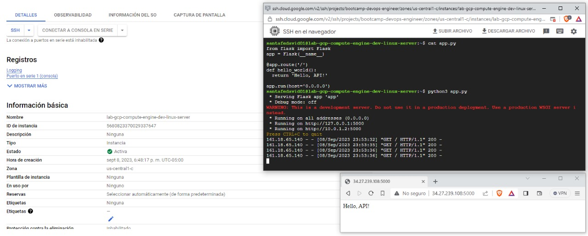

# Configuración de Ejemplo: GCP, Compute Engine
Este repositorio contiene una configuración de ejemplo para el siguiente caso de estudio en GCP utilizando Terraform. En esta configuración, Implementa un servidor web de Flask básico con Terraform, aprenderás cómo comenzar a usar Terraform y crear un servidor web básico en Compute Engine con él.
- Usa Terraform para crear una VM en Google Cloud.
- Inicia un servidor básico de Flask en Python.

## Requisitos Previos
Antes de comenzar, asegúrate de tener lo siguiente:

1. Una cuenta de GCP.
2. [Terraform](https://www.terraform.io/downloads.html) instalado en tu máquina local.
3. Dado que el archivo principal de terraform se va a cargar en el repositorio de código con todo el proyecto, claramente no podemos almacenar ningún dato sensible. Así que pongamos la clave secreta y la clave de acceso en un archivo diferente, y coloquemos este archivo en nuestro gitignore.

Para separar los datos sensibles, crea un archivo en el mismo directorio llamado terraform.tfvars. Y decláralos así:

```terraform
# Application Definition 
app_name        = "lab-gcp-compute-engine" # Do NOT enter any spaces
app_environment = "dev"                    # Dev, Test, Staging, Prod, etc

# GCP Settings
gcp_region  = "us-central1"
gcp_zone    = "us-central1-c"
gcp_project = "bootcamp-devops-engineer-63703"

# Linux Virtual Machine
linux_machine_type = "f1-micro" # En este instructivo, usarás el tipo de máquina más pequeño disponible.

```

## Output del terraform plan.
```bash
Terraform used the selected providers to generate the following execution plan. Resource actions are indicated with the following symbols:
  + create

Terraform will perform the following actions:

  # google_compute_firewall.flask-firewall will be created
  + resource "google_compute_firewall" "flask-firewall" {
      + creation_timestamp = (known after apply)
      + destination_ranges = (known after apply)
      + direction          = (known after apply)
      + enable_logging     = (known after apply)
      + id                 = (known after apply)
      + name               = "lab-gcp-compute-engine-dev-flask-app-firewall"
      + network            = (known after apply)
      + priority           = 1000
      + project            = (known after apply)
      + self_link          = (known after apply)
      + source_ranges      = [
          + "0.0.0.0/0",
        ]

      + allow {
          + ports    = [
              + "5000",
            ]
          + protocol = "tcp"
        }
    }

  # google_compute_firewall.ssh-firewall will be created
  + resource "google_compute_firewall" "ssh-firewall" {
      + creation_timestamp = (known after apply)
      + destination_ranges = (known after apply)
      + direction          = "INGRESS"
      + enable_logging     = (known after apply)
      + id                 = (known after apply)
      + name               = "lab-gcp-compute-engine-dev-ssh-firewall"
      + network            = (known after apply)
      + priority           = 1000
      + project            = (known after apply)
      + self_link          = (known after apply)
      + source_ranges      = [
          + "0.0.0.0/0",
        ]
      + target_tags        = [
          + "ssh",
        ]

      + allow {
          + ports    = [
              + "22",
            ]
          + protocol = "tcp"
        }
    }

  # google_compute_instance.linux-server will be created
  + resource "google_compute_instance" "linux-server" {
      + can_ip_forward          = false
      + cpu_platform            = (known after apply)
      + current_status          = (known after apply)
      + deletion_protection     = false
      + guest_accelerator       = (known after apply)
      + id                      = (known after apply)
      + instance_id             = (known after apply)
      + label_fingerprint       = (known after apply)
      + machine_type            = "f1-micro"
      + metadata_fingerprint    = (known after apply)
      + metadata_startup_script = "sudo apt-get update; sudo apt-get install -yq build-essential python3-pip rsync; pip install flask"       
      + min_cpu_platform        = (known after apply)
      + name                    = "lab-gcp-compute-engine-dev-linux-server"
      + project                 = (known after apply)
      + self_link               = (known after apply)
      + tags                    = [
          + "dev",
          + "lab-gcp-compute-engine-dev-linux-server",
          + "ssh",
        ]
      + tags_fingerprint        = (known after apply)
      + zone                    = "us-central1-c"

      + boot_disk {
          + auto_delete                = true
          + device_name                = (known after apply)
          + disk_encryption_key_sha256 = (known after apply)
          + kms_key_self_link          = (known after apply)
          + mode                       = "READ_WRITE"
          + source                     = (known after apply)

          + initialize_params {
              + image  = "debian-cloud/debian-11"
              + labels = (known after apply)
              + size   = (known after apply)
              + type   = (known after apply)
            }
        }

      + network_interface {
          + ipv6_access_type   = (known after apply)
          + name               = (known after apply)
          + network            = (known after apply)
          + network_ip         = (known after apply)
          + stack_type         = (known after apply)
          + subnetwork         = (known after apply)
          + subnetwork_project = (known after apply)

          + access_config {
              + nat_ip       = (known after apply)
              + network_tier = (known after apply)
            }
        }
    }

  # google_compute_network.vpc_network will be created
  + resource "google_compute_network" "vpc_network" {
      + auto_create_subnetworks                   = false
      + delete_default_routes_on_create           = false
      + gateway_ipv4                              = (known after apply)
      + id                                        = (known after apply)
      + internal_ipv6_range                       = (known after apply)
      + mtu                                       = 1460
      + name                                      = "lab-gcp-compute-engine-dev-vpc"
      + network_firewall_policy_enforcement_order = "AFTER_CLASSIC_FIREWALL"
      + project                                   = (known after apply)
      + routing_mode                              = (known after apply)
      + self_link                                 = (known after apply)
    }

  # google_compute_subnetwork.subnetwork will be created
  + resource "google_compute_subnetwork" "subnetwork" {
      + creation_timestamp         = (known after apply)
      + external_ipv6_prefix       = (known after apply)
      + fingerprint                = (known after apply)
      + gateway_address            = (known after apply)
      + id                         = (known after apply)
      + ip_cidr_range              = "10.0.1.0/24"
      + ipv6_cidr_range            = (known after apply)
      + name                       = "lab-gcp-compute-engine-dev-subnet"
      + network                    = (known after apply)
      + private_ip_google_access   = (known after apply)
      + private_ipv6_google_access = (known after apply)
      + project                    = (known after apply)
      + purpose                    = (known after apply)
      + region                     = "us-central1"
      + secondary_ip_range         = (known after apply)
      + self_link                  = (known after apply)
      + stack_type                 = (known after apply)
    }

Plan: 5 to add, 0 to change, 0 to destroy.

Changes to Outputs:
  + vm_linux_server_instance_ip = (known after apply)
```

## Adjunto evidencia del correcto funcionamiento. 
1. Servidor web de Flask básico con Terraform



## Referencias
- [Implementa un servidor web de Flask básico con Terraform](https://cloud.google.com/docs/terraform/get-started-with-terraform?hl=es-419#ssh-firewall-rule)