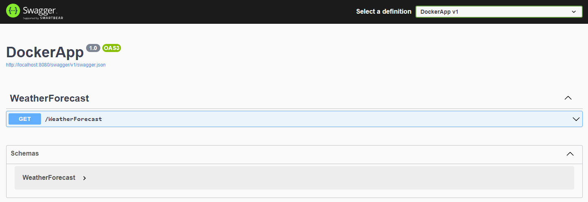
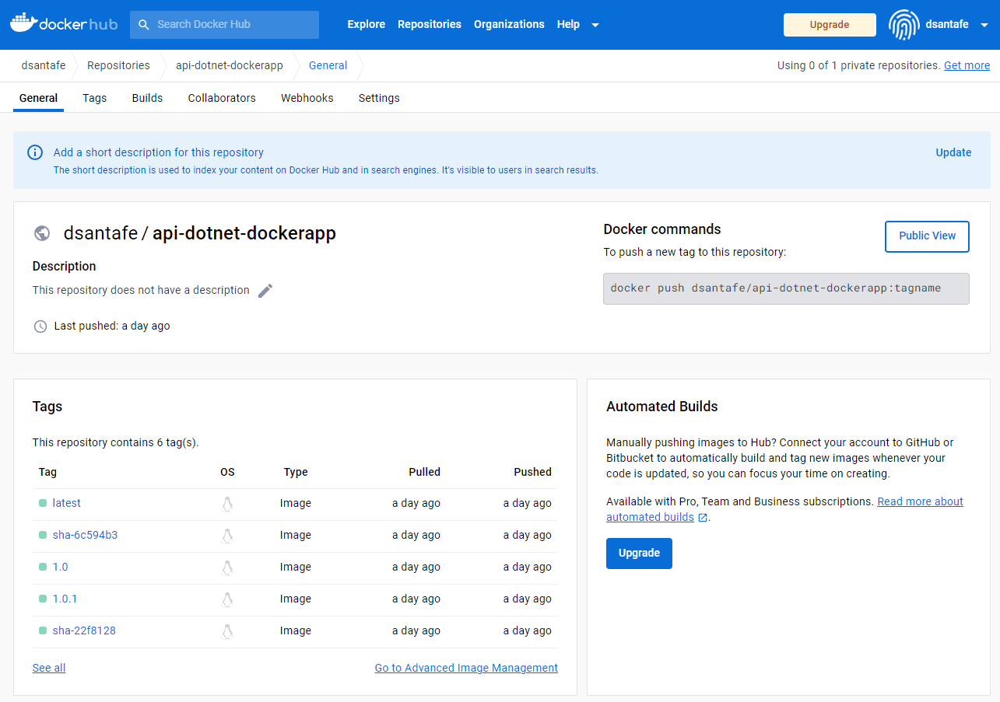
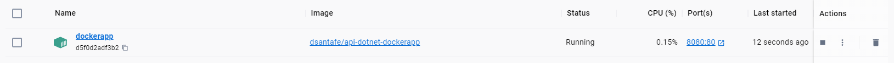
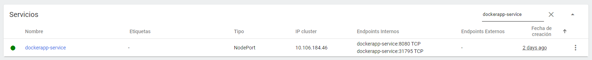
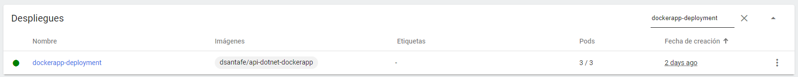
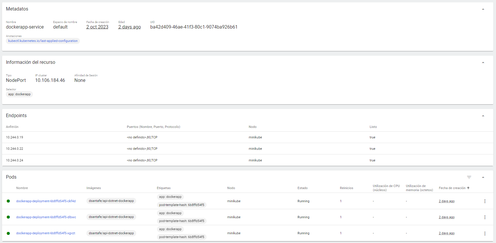

# Despliegue de Aplicación en Docker

Este repositorio contiene los archivos y comandos necesarios para desplegar una aplicación en Docker de una WebApi construida con ASP.NET Core

## Pasos de ejecución

1. Clona este repositorio:
    ```shell
    git clone https://github.com/dsantafe/Bootcamp-Devops-Engineer
    cd Bootcamp-Devops-Engineer/labs/lab-09-docker-dotnet
    ```

2. Construir la imagen:
    ```shell
    $ cd /src/DockerApp/DockerApp/
    $ docker build -t dockerapp:v0.0.1 .
    $ docker images
    ```

3. Ejecutar un contenedor a partir de la imagen:
    ```shell
    $ docker run -d --name dockerapp \
    -e "ASPNETCORE_ENVIRONMENT=Development" \
    -p 8080:80 \
    dockerapp:v0.0.1
    ```

    Nota: También puedes ejecutar un contenedor a partir de un Docker Compose:
      ```shell
      $ cd /src/DockerApp/DockerApp/
      $ docker compose up -d
      ```    

    Ahora puedes acceder a tu API en http://localhost:8080/swagger desde tu navegador o cualquier cliente REST.
      ```shell
      $ curl -X 'GET' \
      'http://localhost:8080/WeatherForecast' \
      -H 'accept: text/plain'

      [{"date":"2023-10-04T03:37:27.9362486+00:00","temperatureC":27,"temperatureF":80,"summary":"Sweltering"},{"date":"2023-10-05T03:37:27.9371344+00:00","temperatureC":4,"temperatureF":39,"summary":"Chilly"},{"date":"2023-10-06T03:37:27.9371437+00:00","temperatureC":20,"temperatureF":67,"summary":"Chilly"},{"date":"2023-10-07T03:37:27.9371439+00:00","temperatureC":42,"temperatureF":107,"summary":"Freezing"},{"date":"2023-10-08T03:37:27.937144+00:00","temperatureC":23,"temperatureF":73,"summary":"Freezing"}]
      ```
      

4. Desarrollar un pipeline de CI/CD en GitHub Actions que realice el build de la imagen y lo publique a Docker Hub.

    - [Administre etiquetas y etiquetas con las acciones de GitHub](https://docs.docker.com/build/ci/github-actions/manage-tags-labels/)
  
    ```yaml
    name: DockerApp DotNet Build and Publish

    on:
      workflow_dispatch:
      push:
        branches:
          - main    
        paths: 
          - 'labs/lab-09-docker-dotnet/src/DockerApp/DockerApp/*' 
        tags:
          - 'v*'

    jobs:
      build-and-publish:
        runs-on: ubuntu-latest

        steps:
          - name: Checkout code
            uses: actions/checkout@v2

          - name: Set up Docker Buildx
            uses: docker/setup-buildx-action@v1

          - name: Login to Docker Hub
            uses: docker/login-action@v1
            with:
              username: ${{ secrets.DOCKER_USERNAME }}
              password: ${{ secrets.DOCKER_PASSWORD }}

          - name: Extract metadata (tags, labels) for Docker
            id: meta
            uses: docker/metadata-action@v5
            with:
              images: dsantafe/api-dotnet-dockerapp
              flavor: latest=true
              tags: |
                type=semver,pattern={{version}}
                type=semver,pattern={{major}}.{{minor}}
                type=sha

          - name: Build and push Docker image
            uses: docker/build-push-action@v2
            with:
              context: ${{ github.workspace }}/labs/lab-09-docker-dotnet/src/DockerApp/DockerApp
              push: true
              tags: ${{ steps.meta.outputs.tags }}
              labels: ${{ steps.meta.outputs.labels }}

    ```


      

5. Ejecutar un contenedor a partir de la imagen publicada:
    ```shell
    $ docker run -d --name dockerapp \
    -e "ASPNETCORE_ENVIRONMENT=Development" \
    -p 8080:80 \
    dsantafe/api-dotnet-dockerapp
    ```

    Nota: También puedes ejecutar un contenedor a partir de un Docker Compose:
      ```shell
      $ cd /docker
      $ docker compose up -d
      ```
      

# Despliegue de Aplicación en Kubernetes usando Minikube

Este repositorio contiene los archivos y comandos necesarios para desplegar una aplicación en un clúster de Kubernetes utilizando Minikube.

## Pasos para desplegar la aplicación

1. **Iniciar Minikube:**

   Asegúrate de que Minikube esté iniciado antes de aplicar las configuraciones. Si no está iniciado, inicia Minikube con el siguiente comando:
   ```bash
   $ minikube start
   $ minikube dashboard
   ```

2. Aplicar el archivo de Deployment:
Aplica el archivo de Deployment para desplegar la aplicación en Kubernetes. Este archivo especifica cómo se deben ejecutar las réplicas de la aplicación.
    ```shell
    $ cd /kubernetes/deployments
    $ kubectl apply -f dockerapp-deployment.yaml
    ```
    

3. Aplicar el archivo de Service:
Aplica el archivo de Service para exponer la aplicación en un puerto específico en Minikube.
    ```shell
    $ cd /kubernetes/services
    $ kubectl apply -f dockerapp-service.yaml
    ```
    

4. Obtener la URL del servicio:
Obtén la URL para acceder a la aplicación a través de Minikube.
    ```shell
    $ minikube service dockerapp-service --url
    ```

    Copia la URL generada y pégala en tu navegador web o utilízala para acceder a tu aplicación.

5. Acceso a la aplicación http://172.22.240.155:31795/swagger
    ```shell
    $ curl -X 'GET' \
    'http://172.22.240.155:31795/WeatherForecast' \
    -H 'accept: text/plain'

    [{"date":"2023-10-04T03:37:27.9362486+00:00","temperatureC":27,"temperatureF":80,"summary":"Sweltering"},{"date":"2023-10-05T03:37:27.9371344+00:00","temperatureC":4,"temperatureF":39,"summary":"Chilly"},{"date":"2023-10-06T03:37:27.9371437+00:00","temperatureC":20,"temperatureF":67,"summary":"Chilly"},{"date":"2023-10-07T03:37:27.9371439+00:00","temperatureC":42,"temperatureF":107,"summary":"Freezing"},{"date":"2023-10-08T03:37:27.937144+00:00","temperatureC":23,"temperatureF":73,"summary":"Freezing"}]
    ```
    