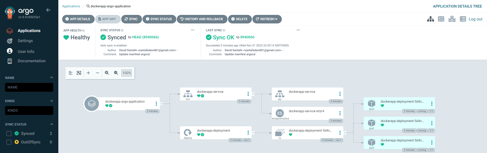
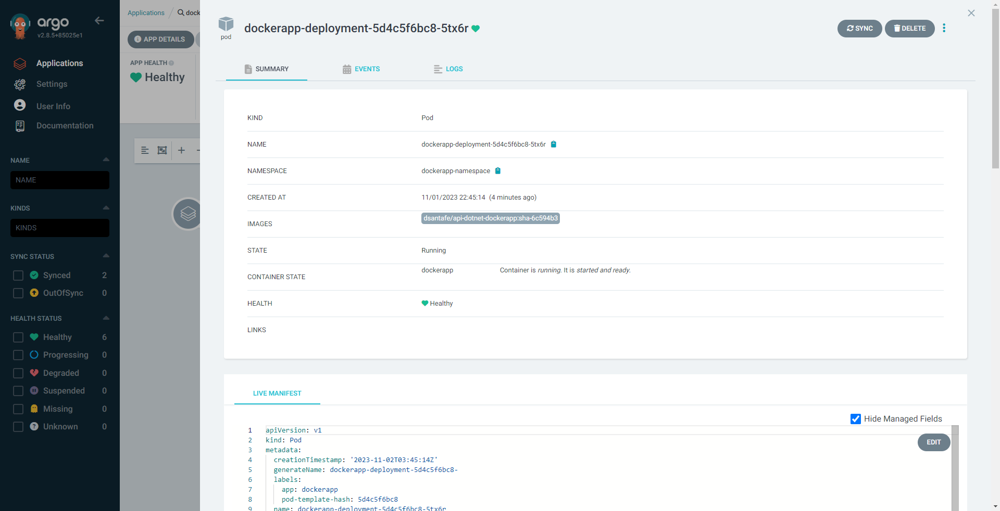
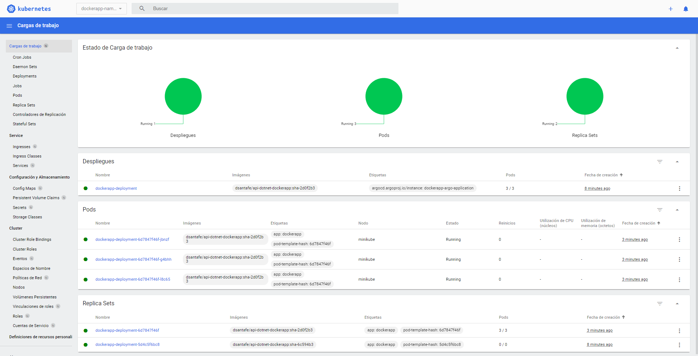
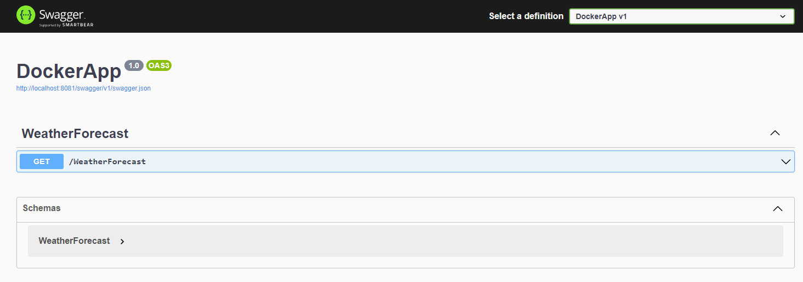
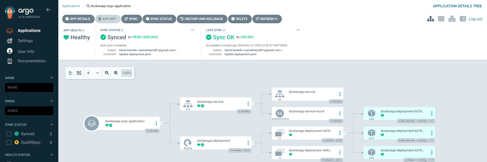
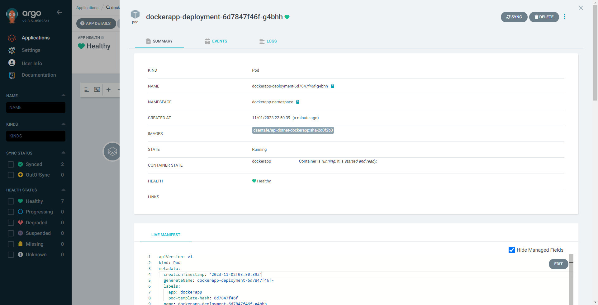
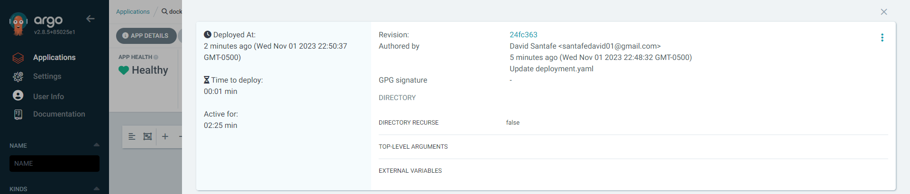
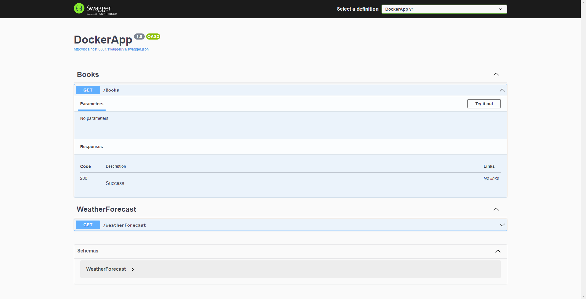

# Despliegue de Aplicación en Kubernetes usando Minikube y Argo CD

Este repositorio contiene los archivos y comandos necesarios para desplegar una aplicación en un clúster de Kubernetes utilizando Minikube y Argo CD.

## Pasos para desplegar la aplicación

1. Clona este repositorio:
    ```shell
    git clone https://github.com/dsantafe/Bootcamp-Devops-Engineer
    cd Bootcamp-Devops-Engineer/labs/lab-10-kubernetes-argocd
    ```

2. Iniciar Minikube:

   Asegúrate de que Minikube esté iniciado antes de aplicar las configuraciones. Si no está iniciado, inicia Minikube con el siguiente comando:
   ```shell
   $ minikube start
   $ minikube dashboard
   ```

3. Instalar e iniciar Argo CD:

   Instalación del Chart
   ```shell
   $ kubectl create ns argo-cd
   $ helm repo add argo https://argoproj.github.io/argo-helm
   $ helm install argocd argo/argo-cd -n argo-cd
   ```

   Para acceder a la interfaz de usuario del servidor, tiene las siguientes opciones y luego abra el navegador en http://localhost:8080 y acepte el certificado.
   ```shell
   $ kubectl port-forward service/argocd-server -n argo-cd 8080:443
   ```

   Después de acceder a la interfaz de usuario por primera vez, puede iniciar sesión con el nombre de usuario: admin y la contraseña aleatoria generada durante la instalación. Puede encontrar la contraseña ejecutando:
   ```shell
   $ kubectl -n argo-cd get secret argocd-initial-admin-secret -o jsonpath="{.data.password}" | base64 -d
   ```

4. Aplicar el archivo de ArgoCD:
Aplica el archivo de ArgoCD para desplegar la aplicación en Kubernetes. Este archivo referencia la carpeta /dev donde especifica el servicio para exponer la aplicación en un puerto específico en Minikube y cómo se deben ejecutar las réplicas de la aplicación.
    ```shell    
    $ kubectl apply -f application.yaml
    ```
    ArgoCD
    
    
    Minikube Namespace
    

5. Obtener la URL del servicio:
Obtén la URL para acceder a la aplicación a través de Minikube.
    ```shell
    $ kubectl port-forward service/dockerapp-service -n dockerapp-namespace 8081:8080
    ```

6. Acceder a la aplicación http://localhost:8081/swagger desplegada con la imagen de Docker **dsantafe/api-dotnet-dockerapp:sha-6c594b3**
    ```shell
    $ curl -X 'GET' \
    'http://localhost:8081/WeatherForecast' \
    -H 'accept: text/plain'
    ```
    Swagger DockerApp
    

7. Modificar el archivo /dev/dockerapp-deployment.yaml con la imagen **dsantafe/api-dotnet-dockerapp:sha-2d0f2b3** para la sincronización automática de ArgoCD (por defecto se ejecuta cada 3 minutos).
    ```yaml
    image: dsantafe/api-dotnet-dockerapp:sha-2d0f2b3
    ```
    ArgoCD
    
    
    

    Notas: repite nuevamente el paso #5 y podrás evidenciar un nuevo endpoint disponible en la aplicación.
     ```shell
    $ curl -X 'GET' \
    'http://localhost:8081/Books' \
    -H 'accept: text/plain'
    ```
    Swagger DockerApp
    

## Links
- Config repo: https://github.com/dsantafe/Bootcamp-Devops-Engineer
- Docker repo: https://hub.docker.com/repository/docker/dsantafe/api-dotnet-dockerapp
- Install ArgoCD: https://argo-cd.readthedocs.io/en/stable/getting_started/#1-install-argo-cd
- Login to ArgoCD: https://argo-cd.readthedocs.io/en/stable/getting_started/#4-login-using-the-cli
- ArgoCD Configuration: https://argo-cd.readthedocs.io/en/stable/operator-manual/declarative-setup/