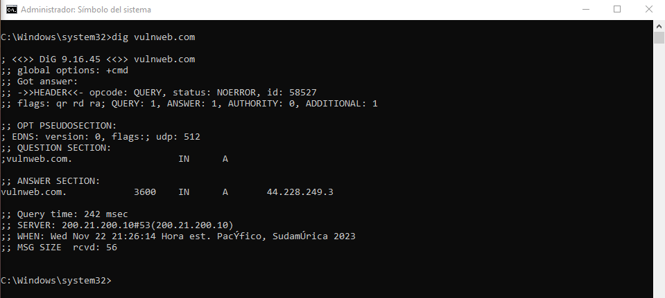
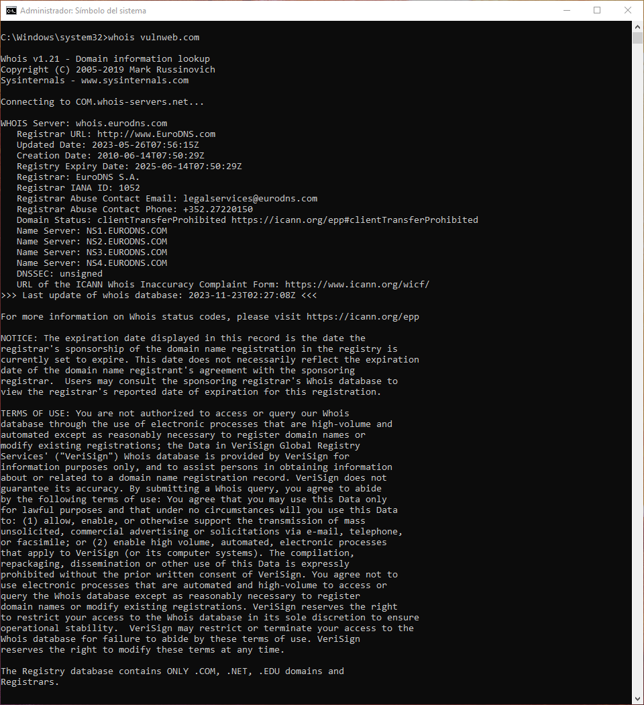
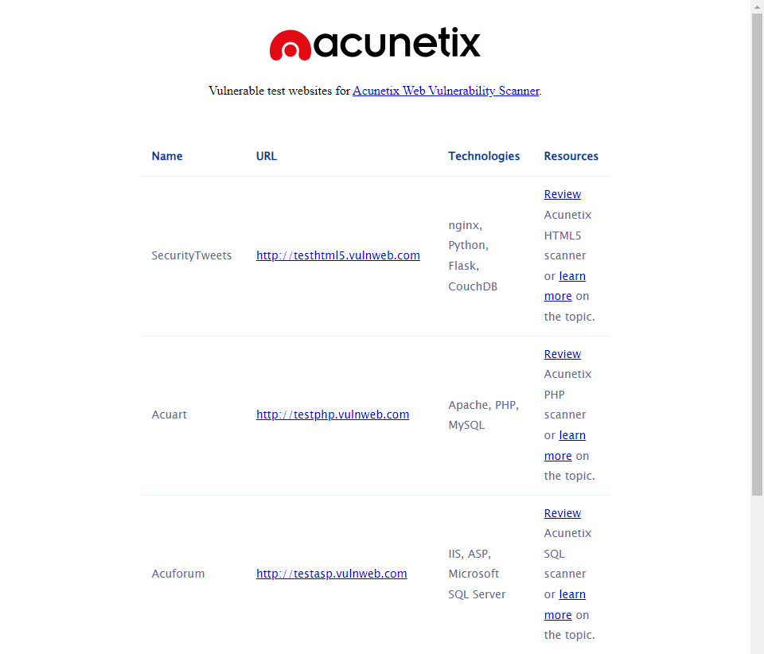
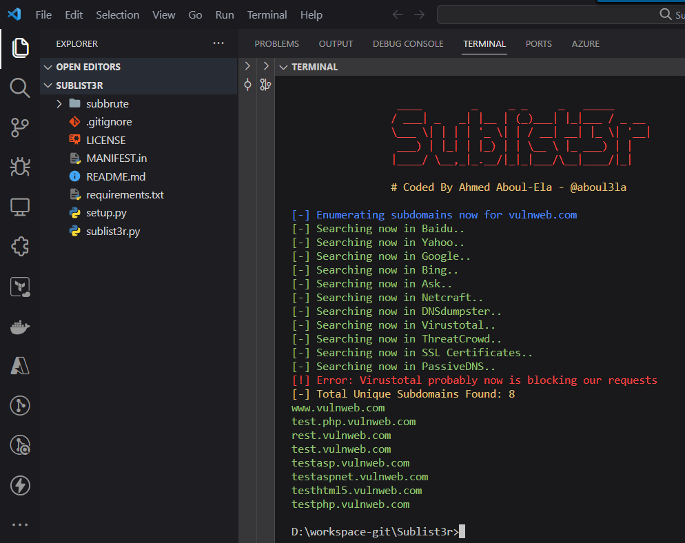
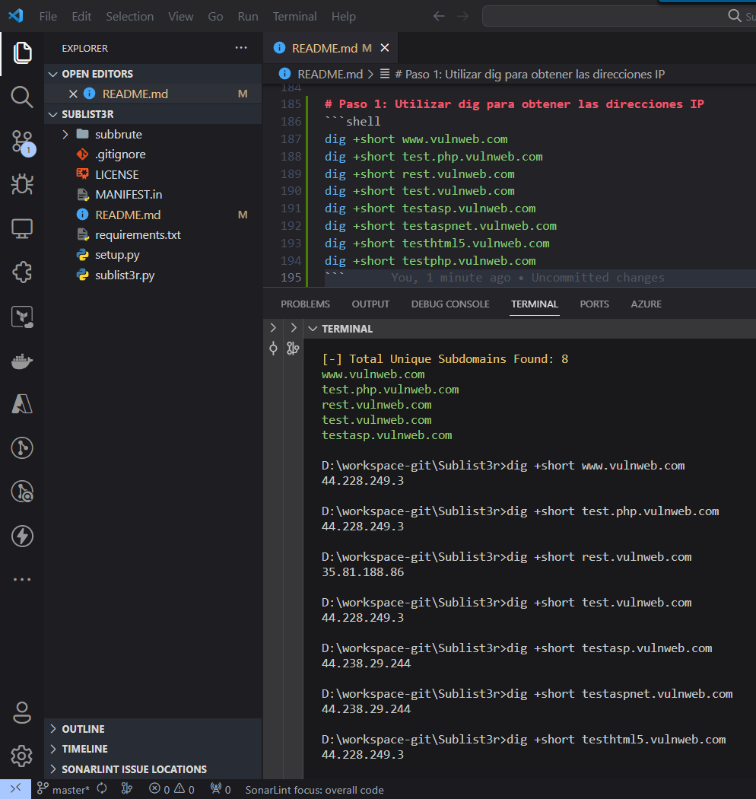
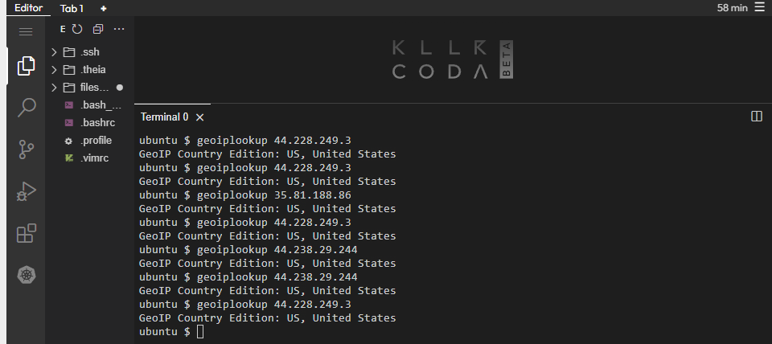
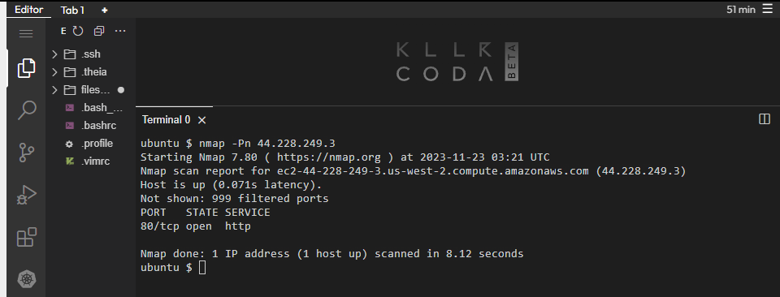
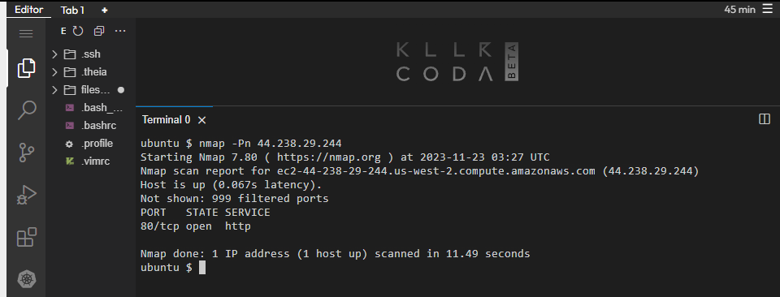
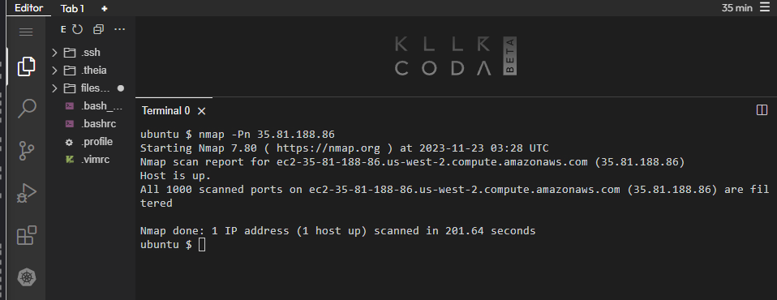

# Práctica sobre Seguridad IT

Este repositorio proporciona instrucciones para realizar una investigación básica sobre el dominio "vulnweb.com" utilizando diversas herramientas de línea de comandos y servicios en línea. Adicional lleva a cabo una investigación detallada de sitios web, incluyendo la identificación de direcciones IP, geolocalización y detalles sobre puertos abiertos. Se utilizarán herramientas como dig, geoiplookup y nmap.

## Pasos para ejecutar los ejercicios

1. Clona este repositorio:
```shell
git clone https://github.com/dsantafe/Bootcamp-Devops-Engineer
cd Bootcamp-Devops-Engineer/labs/lab-11-web-sec
```

## Ejercicio 1: Investigación del Dominio "vulnweb.com"
### Paso 1: Utilizar dig y whois
Abre tu terminal y ejecuta los siguientes comandos:
- Windows:
```shell
# Utilizar dig para obtener información de DNS
dig vulnweb.com

# Utilizar whois para obtener información del dominio
whois vulnweb.com
```


Estos comandos proporcionarán detalles sobre la configuración de DNS y la información de registro del dominio.

### Paso 2: Utilizar Google
Busca información adicional sobre el dominio "vulnweb.com" en Google. Ingresa "vulnweb.com" en el motor de búsqueda y revisa los resultados.


### Paso 3: Identificar Sitios Web Hosteados
Utiliza herramientas en línea para identificar qué sitios web están hosteados en "vulnweb.com". La seleccionada para este laboratorio fue Sublist3r.
- Windows:
```shell
$ choco install python
$ python -m pip install -U pip
$ git clone https://github.com/aboul3la/Sublist3r.git
$ C:\Python312\python.exe -m pip install -r requirements.txt
$ C:\Python312\python.exe -m pip install requests
$ C:\Python312\python.exe -m pip install dnspython
$ C:\Python312\python.exe -m pip install win_unicode_console colorama
$ python sublist3r.py -d vulnweb.com
```

Esta herramienta te proporcionarán una lista de subdominios asociados con "vulnweb.com".

## Ejercicio 2: Investigación de Sitios Web y Geolocalización

### Paso 1: Utilizar dig para obtener las direcciones IP
### Paso 2: Identificar la dirección IP de cada sitio
Abre tu terminal y ejecuta el siguiente comando para obtener las direcciones IP de los sitios web específicos.
- Windows:
```shell
$ dig +short www.vulnweb.com (44.228.249.3)
$ dig +short test.php.vulnweb.com (44.228.249.3)
$ dig +short rest.vulnweb.com (35.81.188.86)
$ dig +short test.vulnweb.com (44.228.249.3)
$ dig +short testasp.vulnweb.com (44.238.29.244)
$ dig +short testaspnet.vulnweb.com (44.238.29.244)
$ dig +short testhtml5.vulnweb.com (44.228.249.3)
$ dig +short testphp.vulnweb.com (44.228.249.3)
```

Esto te proporcionará las direcciones IP asociadas con los sitios web. Tal como se muestra entre paréntesis. Toma nota de las direcciones IP obtenidas anteriormente.

### Paso 3: Utilizar la herramienta geoip
Utiliza una herramienta como geoiplookup para identificar la geolocalización de cada dirección IP. Asegúrate de tener instalada la herramienta.
- Linux:
```shell
$ sudo apt-get install geoip-bin
$ geoiplookup 44.228.249.3
$ geoiplookup 35.81.188.86
$ geoiplookup 44.238.29.244
```

Esto te dará información sobre la ubicación geográfica de cada dirección IP.

### Paso 4: Utilizar nmap para obtener información adicional
Utiliza nmap para obtener información adicional, como puertos abiertos, de cada dirección IP.
- Linux:
```shell
$ sudo apt-get install nmap
$ nmap -Pn 44.228.249.3
$ nmap -Pn 35.81.188.86
$ nmap -Pn 44.238.29.244
```



Esto escaneará los puertos de las direcciones IP proporcionando información sobre los puertos abiertos y otros detalles.

Nota: El uso de herramientas como nmap para escanear puertos sin permiso puede infringir los términos de servicio de algunos proveedores de servicios. Asegúrate de tener el permiso adecuado antes de realizar actividades de escaneo.

Este conjunto de pasos te permitirá obtener información detallada sobre los sitios web, incluyendo sus direcciones IP, geolocalización y detalles sobre los puertos abiertos utilizando herramientas como dig, geoiplookup y nmap.

## Conclusión
- Tras analizar la información recopilada de los sitios web alojados en 'vulnweb.com', se destaca la importancia de abordar ciertos aspectos de seguridad. La exposición de información en los resultados de whois y la identificación de la geolocalización de las direcciones IP resaltan posibles puntos de vulnerabilidad. Además, el escaneo de puertos realizado con nmap revela la presencia de puertos abiertos, lo que podría representar una superficie de ataque para posibles intrusiones.
- En resumen, se recomienda una evaluación más profunda de la configuración de seguridad, la implementación de medidas de protección adecuadas y la monitorización constante para mitigar riesgos potenciales. Estos hallazgos subrayan la importancia de mantener una postura proactiva en materia de ciberseguridad para prevenir posibles amenazas y fortalecer la seguridad del entorno digital asociado a 'vulnweb.com'.

## Links
- Config repo: https://github.com/dsantafe/Bootcamp-Devops-Engineer
- Download ISC: https://www.isc.org/download/
- Whois Introduction and Usage : https://learn.microsoft.com/en-us/sysinternals/downloads/whois#introduction
- Killercoda Interactive Environments: https://killercoda.com/